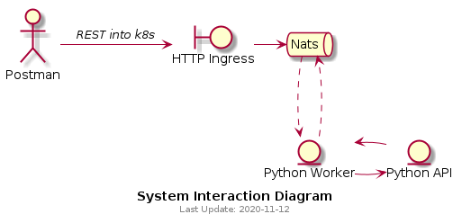

# Overall architecture

## Genesis of project
This is a proof of concept for a microservice distributed system running on k8s. 
I will use it as a sandbox to test different deployment methods. 

## Tooling
- Gitlab
- Google Kubernetes Engine (GKE)
- PlantUML (Alt D to use on vscode)

## Applications

1. ### HTTP ingress proxy
2. ### NATS Core
3. ### Python Worker
4. ### Python API